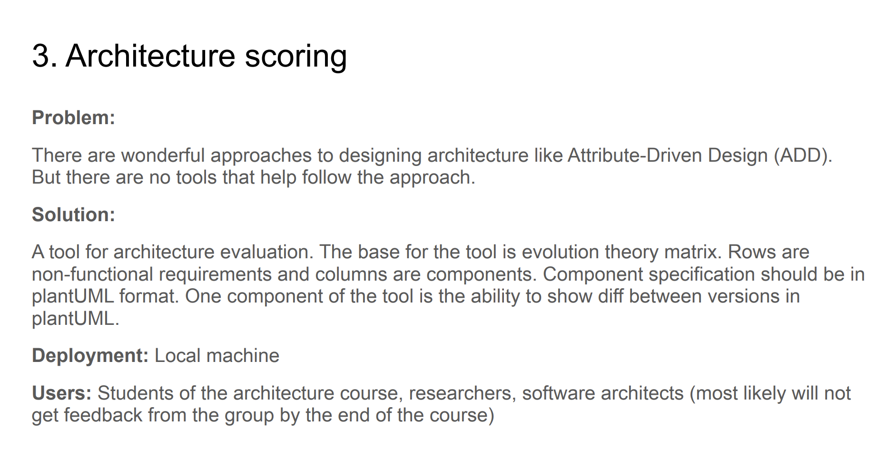

# Initial research

Research before first customer meeting

## Project

### Similar Solutions and Tools

- https://www.atruedev.com/blog/introducing-architecture-tools

### Terminology Research

1. *ADD*

- https://habr.com/ru/companies/simbirsoft/articles/571554/
- https://en.wikipedia.org/wiki/Attribute-driven_design

2. *PlantUML*

- https://en.wikipedia.org/wiki/PlantUML

3. *Evolution theory matrix*
**IMPORTANT TO DISCUSS AND FIND EXAMPLES**

| RequirementId | RequirementName                                       | Description | UML                                      |
| ------------- | ----------------------------------------------------- | ----------- | ---------------------------------------- |
| NF1           | SLA is 99.999                                         | ...         | ?                                        |
| R2            | User is able to get A from B in C time with D actions | ...         | Prerequirements: B User -> D & C -> A |
|               |                                                       |             |                                          |

4. Results

- Difference in resulted UML?
- Some score based on ....?
